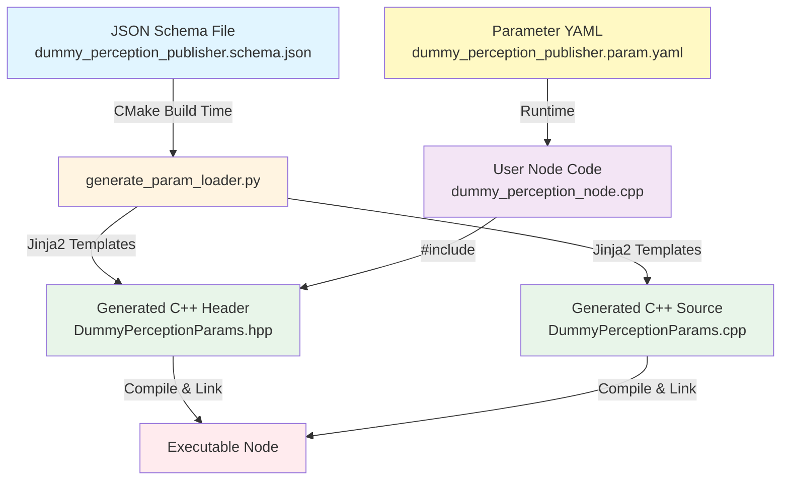

# ROS2 JSON Schema-Based Parameter Code Generation System

## Overview

This system provides **automatic C++ code generation** for ROS2 parameters using JSON Schema as the single source of truth. By defining your parameters once in a JSON Schema file, the system automatically generates type-safe C++ parameter loading code with built-in validation, eliminating boilerplate and reducing errors.

**🎯 Key Highlight**: Full support for **nested parameter objects** through JSON Schema's `object` type, enabling hierarchical parameter organization with automatic C++ struct generation!

### Key Benefits

- **Single Source of Truth**: Define parameters once in JSON Schema
- **Automatic Code Generation**: C++ parameter loaders generated at build time
- **Type Safety**: Compile-time type checking for all parameters (primitives, arrays, and objects)
- **Runtime Validation**: Automatic validation of constraints (min, max, enum)
- **🔥 Nested Structures**: Full support for complex nested parameter objects via JSON Schema `object` type
  - Nested objects → C++ structs with natural member access syntax
  - Each nested object gets its own validation and loading methods
- **Zero Boilerplate**: No manual parameter declaration/loading code needed
- **Documentation Embedded**: Parameter descriptions from schema appear in generated code

---

## System Architecture

The system consists of two ROS2 packages:

### 1. `ros_schema2param` (Code Generation Framework)

This is the **infrastructure package** that provides:
- Python script (`generate_param_loader.py`) for parsing JSON Schema and generating C++
- Jinja2 templates for generating header and source files
- CMake functions for integrating code generation into build process
- Header-only utilities for parameter type traits
- **Full JSON Schema object support** for nested parameter structures

### 2. `dummy_perception_example` (Example Usage)

This is a **demonstration package** showing how to use the system:
- Example JSON Schema defining perception parameters with nested objects
- Example ROS2 node using generated parameter loader
- Launch files and parameter YAML files
- Demonstrates nested object handling (`vehicle` and `pedestrian` sub-structures)

---

## System Workflow



### Workflow Steps

1. **Design Phase**: Developer writes JSON Schema defining all parameters with types, constraints, defaults
2. **Build Phase**: CMake invokes Python generator to create C++ parameter loader classes
3. **Compile Phase**: Generated C++ code is compiled and linked with user's node
4. **Runtime Phase**: Node loads parameters from YAML using generated loader with automatic validation

---

## Detailed Component Breakdown

### A. JSON Schema Definition

**Location**: `dummy_perception_example/schema/dummy_perception_publisher.schema.json`

The schema defines the complete parameter structure:

```json
{
  "$schema": "http://json-schema.org/draft-07/schema#",
  "title": "Parameters for dummy_perception_publisher_node",
  "definitions": {
    "dummy_perception_publisher": {
      "type": "object",
      "properties": {
        "visible_range": {
          "type": "number",
          "description": "Maximum visible range for object detection in meters"
        },
        "enable_ray_tracing": {
          "type": "boolean",
          "default": true,
          "description": "Enable ray tracing for visibility calculation"
        },
        "random_seed": {
          "type": "integer",
          "default": 0,
          "description": "Random seed for reproducible results"
        },
        "vehicle": {
          "type": "object",
          "properties": {
            "max_remapping_distance": {
              "type": "number",
              "default": 2.0,
              "minimum": 0.0,
              "description": "Maximum distance in meters"
            },
            "path_selection_strategy": {
              "type": "string",
              "default": "highest_confidence",
              "enum": ["highest_confidence", "random"],
              "description": "Path selection strategy"
            }
          },
          "required": ["max_remapping_distance", "path_selection_strategy"]
        }
      },
      "required": ["visible_range", "vehicle"]
    }
  }
}
```

**Supported JSON Schema Features**:
- **Primitive Types**: `boolean`, `integer`, `number`, `string`
- **Arrays**: `array` with typed items (e.g., `number[]`, `string[]`)
- **🎯 Objects**: Full support for nested parameter structures via `object` type
  - Creates C++ structs for each nested object
  - Supports arbitrary nesting depth
  - Each object has its own `load()`, `declare_and_load()`, and `validate()` methods
  - Natural member access: `params.vehicle.max_speed`
- **Constraints**: `minimum`, `maximum`, `enum` (validated automatically)
- **Defaults**: Default values for optional parameters
- **Documentation**: `description` fields for all parameters

**Type Mapping**:
| JSON Schema Type | C++ Type | ROS2 Getter | Notes |
|-----------------|----------|-------------|-------|
| `boolean` | `bool` | `as_bool()` | Single boolean value |
| `integer` | `int64_t` | `as_int()` | 64-bit signed integer |
| `number` | `double` | `as_double()` | Double-precision float |
| `string` | `std::string` | `as_string()` | UTF-8 string |
| `array` of `boolean` | `std::vector<bool>` | `as_bool_array()` | Boolean vector |
| `array` of `integer` | `std::vector<int64_t>` | `as_integer_array()` | Integer vector |
| `array` of `number` | `std::vector<double>` | `as_double_array()` | Double vector |
| `array` of `string` | `std::vector<std::string>` | `as_string_array()` | String vector |
| **`object`** | **Custom C++ struct** | **Nested calls** | **🎯 Generates dedicated struct** |

### B. Nested Object Support (JSON Schema `object` Type)

**🎯 This is a KEY feature** - The system provides full support for nested parameter structures using JSON Schema's `object` type!

#### How It Works

When you define a parameter with `"type": "object"` in your schema:

1. **Schema Definition**:
```json
{
  "vehicle": {
    "type": "object",
    "description": "Vehicle-specific parameters",
    "properties": {
      "max_speed": { "type": "number", "default": 50.0 },
      "max_acceleration": { "type": "number", "default": 5.0 },
      "path_selection_strategy": { 
        "type": "string", 
        "enum": ["fastest", "safest"],
        "default": "fastest"
      }
    },
    "required": ["max_speed", "max_acceleration", "path_selection_strategy"]
  }
}
```

2. **Generated C++ Struct**:
```cpp
/// Vehicle-specific parameters
struct VehicleParams {
  double max_speed = 50.0;
  double max_acceleration = 5.0;
  std::string path_selection_strategy = "fastest";
  
  void load(rclcpp::Node * node, const std::string & prefix);
  void declare_and_load(rclcpp::Node * node, const std::string & prefix);
  void validate() const;
};
```

3. **Main Class Integration**:
```cpp
class MyParams {
public:
  VehicleParams vehicle;  // Nested struct member
  // ... other parameters
};
```

4. **Usage in Your Node**:
```cpp
params_.declare_and_load(this);
double max_speed = params_.vehicle.max_speed;  // Natural member access!
std::string strategy = params_.vehicle.path_selection_strategy;
```

5. **YAML Configuration**:
```yaml
/**:
  ros__parameters:
    vehicle:
      max_speed: 60.0
      max_acceleration: 6.5
      path_selection_strategy: "safest"
```

#### Advantages of Nested Objects

- **🏗️ Logical Organization**: Group related parameters together
- **🔍 Namespace Management**: Avoid parameter name collisions
- **📦 Encapsulation**: Each object validates its own constraints
- **🔄 Reusability**: Define common parameter groups once
- **🎯 Type Safety**: Full compile-time checking for nested members
- **📝 Self-Documenting**: Structure reflects parameter relationships


### C. Code Generation Process

**Generator Script**: `ros_schema2param/scripts/generate_param_loader.py`

The Python script performs these steps:

1. **Parse JSON Schema**
   - Validates schema using `jsonschema` library
   - Extracts parameter definitions from `definitions` section
   - Recursively processes nested objects

2. **Convert to C++ Representations**
   - Maps JSON types to C++ types
   - Converts parameter names to valid C++ identifiers
   - Creates struct types for nested objects
   - Extracts constraints and defaults

3. **Generate Code via Jinja2 Templates**
   - **Header Template** (`param_loader.hpp.j2`): Class/struct declarations
   - **Source Template** (`param_loader.cpp.j2`): Method implementations

**Key Classes in Generator**:

- `ParameterInfo`: Dataclass holding parsed parameter metadata
- `SchemaParser`: Parses JSON Schema and extracts parameter information
- `CodeGenerator`: Generates C++ code using Jinja2 templates

### C. CMake Integration

**CMake Function**: `ros2_generate_parameter_loader()`

**Location**: `ros_schema2param/cmake/ros_schema2param.cmake`

**Usage in CMakeLists.txt**:

```cmake
find_package(ros_schema2param REQUIRED)

add_executable(my_node src/my_node.cpp)

ros2_generate_parameter_loader(
    TARGET my_node
    SCHEMA schema/my_params.schema.json
    OUTPUT_DIR generated
    NAMESPACE my_namespace
    CLASS_NAME MyParams
)
```

**What This Does**:

1. Creates custom build command to run Python generator
2. Generates `MyParams.hpp` and `MyParams.cpp` in `build/generated/`
3. Adds generated files to target's sources
4. Adds `build/generated/` to target's include paths
5. Sets up dependency chain so code regenerates when schema changes

**Optional**: Header-only generation (no `.cpp` file)

```cmake
ros2_generate_parameter_loader(
    TARGET my_node
    SCHEMA schema/my_params.schema.json
    OUTPUT_DIR generated
    NAMESPACE my_namespace
    CLASS_NAME MyParams
    HEADER_ONLY
)
```

### D. Generated C++ Code Structure

**Generated Header** (e.g., `DummyPerceptionParams.hpp`):

```cpp
namespace dummy_perception {

// Nested struct for "vehicle" object
struct VehicleParams {
  double max_remapping_distance = 2.0;
  std::string path_selection_strategy = "highest_confidence";
  
  void load(rclcpp::Node * node, const std::string & prefix);
  void declare_and_load(rclcpp::Node * node, const std::string & prefix);
  void validate() const;
};

// Main parameter class
class DummyPerceptionParams {
public:
  // Primitive members
  double visible_range;
  bool enable_ray_tracing = true;
  int64_t random_seed = 0;
  
  // Nested struct members
  VehicleParams vehicle;
  
  // Array members
  std::vector<double> lat_jerk_lim_for_steer_cmd;
  
  // Methods
  void load(rclcpp::Node * node);
  void declare_and_load(rclcpp::Node * node);
  void validate() const;
  void print(const rclcpp::Logger & logger) const;
};

}  // namespace dummy_perception
```

**Key Methods**:

- **`declare_and_load()`**: Declares parameters with defaults, then loads values
- **`load()`**: Loads parameters (assumes already declared)
- **`validate()`**: Checks min/max constraints, enum values
- **`print()`**: Logs all parameter values for debugging

### E. User Node Implementation

**Location**: `dummy_perception_example/src/dummy_perception_node.cpp`

```cpp
#include <rclcpp/rclcpp.hpp>
#include "DummyPerceptionParams.hpp"  // Auto-generated

class DummyPerceptionPublisherNode : public rclcpp::Node {
public:
  DummyPerceptionPublisherNode()
  : Node("dummy_perception_publisher")
  {
    // Load parameters using generated loader
    params_.declare_and_load(this);
    
    // Print loaded parameters
    params_.print(this->get_logger());
    
    // Access parameters with type safety
    RCLCPP_INFO(
      this->get_logger(),
      "Visible range: %.2f m", 
      params_.visible_range
    );
    
    // Access nested parameters
    RCLCPP_INFO(
      this->get_logger(),
      "Vehicle max remapping distance: %.2f m",
      params_.vehicle.max_remapping_distance
    );
    
    // Use parameters in your logic
    if (params_.enable_ray_tracing) {
      // Ray tracing enabled...
    }
  }

private:
  dummy_perception::DummyPerceptionParams params_;
};

int main(int argc, char ** argv) {
  rclcpp::init(argc, argv);
  auto node = std::make_shared<DummyPerceptionPublisherNode>();
  rclcpp::spin(node);
  rclcpp::shutdown();
  return 0;
}
```

**Note**: The user code is extremely clean - no manual parameter declarations, no repetitive `get_parameter()` calls, just one line to load everything!

### F. Parameter YAML File

**Location**: `dummy_perception_example/config/dummy_perception_publisher.param.yaml`

```yaml
/**:
  ros__parameters:
    # Maximum visible range for object detection in meters
    visible_range: 120.0
    
    # Enable ray tracing for visibility calculation
    enable_ray_tracing: true
    
    # Random seed for reproducible results
    random_seed: 0
    
    # Array of limits for lateral jerk
    lat_jerk_lim_for_steer_cmd: [8.0, 7.0, 7.0, 6.0]
    
    # Parameters for vehicle object validation
    vehicle:
      max_remapping_distance: 2.0
      path_selection_strategy: "highest_confidence"
    
    # Parameters for pedestrian object validation
    pedestrian:
      max_remapping_distance: 3.0
      path_selection_strategy: "random"
```

This YAML must match the structure defined in the JSON Schema. The generated loader will validate types and constraints at runtime.

### G. Launch File

**Location**: `dummy_perception_example/launch/dummy_perception_publisher.launch.xml`

```xml
<?xml version="1.0"?>
<launch>
  <node pkg="dummy_perception_example" 
        exec="dummy_perception_node" 
        name="dummy_perception_node" 
        output="screen">
    <param from="$(find-pkg-share dummy_perception_example)/config/dummy_perception_publisher.param.yaml"/>
  </node>
</launch>
```

---

## Advanced Features

### 1. Nested Parameter Structures

The system automatically generates C++ structs for nested JSON objects:

**Schema**:
```json
{
  "vehicle": {
    "type": "object",
    "properties": {
      "max_speed": { "type": "number", "default": 50.0 },
      "max_acceleration": { "type": "number", "default": 5.0 }
    }
  }
}
```

**Generated**:
```cpp
struct VehicleParams {
  double max_speed = 50.0;
  double max_acceleration = 5.0;
  void validate() const;
};

class MyParams {
public:
  VehicleParams vehicle;
};
```

**Usage**:
```cpp
params_.declare_and_load(this);
double speed = params_.vehicle.max_speed;
```

### 2. Array Parameters

Support for homogeneous arrays:

**Schema**:
```json
{
  "waypoints": {
    "type": "array",
    "items": { "type": "number" },
    "description": "List of waypoint positions"
  }
}
```

**Generated**:
```cpp
std::vector<double> waypoints;
```

### 3. Validation with Constraints

Automatic validation of min/max/enum constraints:

**Schema**:
```json
{
  "speed": {
    "type": "number",
    "minimum": 0.0,
    "maximum": 100.0
  },
  "mode": {
    "type": "string",
    "enum": ["auto", "manual", "remote"]
  }
}
```

**Generated Validation**:
```cpp
void validate() const {
  if (speed < 0.0 || speed > 100.0) {
    throw std::runtime_error("Parameter 'speed' out of range");
  }
  
  const std::vector<std::string> valid_modes = {"auto", "manual", "remote"};
  if (std::find(valid_modes.begin(), valid_modes.end(), mode) == valid_modes.end()) {
    throw std::runtime_error("Invalid value for parameter 'mode'");
  }
}
```

This validation runs automatically when `load()` or `declare_and_load()` is called.

### 4. Header-Only Mode

For template-heavy code or small parameter sets, generate header-only:

```cmake
ros2_generate_parameter_loader(
    TARGET my_node
    SCHEMA schema/params.schema.json
    OUTPUT_DIR generated
    CLASS_NAME Params
    HEADER_ONLY  # No .cpp file generated
)
```

All method implementations become `inline` in the header.

---

## How to Use in Your Own Package

### Step 1: Add Dependency

**package.xml**:
```xml
<build_depend>ros_schema2param</build_depend>
```

### Step 2: Create JSON Schema

Create `schema/my_params.schema.json`:

```json
{
  "$schema": "http://json-schema.org/draft-07/schema#",
  "title": "Parameters for my_node",
  "definitions": {
    "my_node": {
      "type": "object",
      "properties": {
        "my_param": {
          "type": "number",
          "default": 1.0,
          "description": "My awesome parameter"
        }
      },
      "required": ["my_param"]
    }
  },
  "properties": {
    "/**": {
      "type": "object",
      "properties": {
        "ros__parameters": {
          "$ref": "#/definitions/my_node"
        }
      },
      "required": ["ros__parameters"]
    }
  },
  "required": ["/**"]
}
```

### Step 3: Update CMakeLists.txt

```cmake
find_package(ros_schema2param REQUIRED)

add_executable(my_node src/my_node.cpp)

ros2_generate_parameter_loader(
    TARGET my_node
    SCHEMA schema/my_params.schema.json
    OUTPUT_DIR generated
    NAMESPACE my_namespace
    CLASS_NAME MyParams
)

ament_target_dependencies(my_node rclcpp)

install(TARGETS my_node DESTINATION lib/${PROJECT_NAME})
```

### Step 4: Write Your Node

**src/my_node.cpp**:
```cpp
#include <rclcpp/rclcpp.hpp>
#include "MyParams.hpp"

class MyNode : public rclcpp::Node {
public:
  MyNode() : Node("my_node") {
    params_.declare_and_load(this);
    params_.print(this->get_logger());
    
    // Use params_.my_param in your code
  }

private:
  my_namespace::MyParams params_;
};

int main(int argc, char ** argv) {
  rclcpp::init(argc, argv);
  rclcpp::spin(std::make_shared<MyNode>());
  rclcpp::shutdown();
  return 0;
}
```

### Step 5: Create Parameter YAML

**config/my_params.yaml**:
```yaml
/**:
  ros__parameters:
    my_param: 2.5
```

### Step 6: Build and Run

```bash
colcon build --packages-select my_package
ros2 run my_package my_node --ros-args --params-file config/my_params.yaml
```

---

## Build Process Details

### What Happens During Build

1. **CMake Configure Phase**:
   - `find_package(ros_schema2param)` locates the generator
   - `ros2_generate_parameter_loader()` sets up custom command

2. **Build Phase**:
   - CMake detects schema file as dependency
   - Executes: `python3 generate_param_loader.py --schema ... --output-dir ...`
   - Python script parses schema, renders Jinja2 templates
   - Generates `.hpp` and `.cpp` files in build directory
   - C++ compiler compiles generated code
   - Linker links generated code with user node

3. **Incremental Builds**:
   - If schema changes, code regenerates automatically
   - If only node code changes, schema code doesn't rebuild

### Generated File Locations

```
build/
  my_package/
    generated/           # OUTPUT_DIR specified in CMake
      MyParams.hpp       # Generated header
      MyParams.cpp       # Generated source (if not header-only)
```

Your code includes the generated header as:
```cpp
#include "MyParams.hpp"  // No path needed, CMake adds generated/ to include path
```

---

## Design Philosophy & Rationale

### Why JSON Schema?

1. **Industry Standard**: JSON Schema is widely used and well-documented
2. **Tool Ecosystem**: Many validators, editors, documentation generators exist
3. **Type System**: Rich type system with constraints (min, max, enum, etc.)
4. **Documentation Integration**: Descriptions embedded in schema
5. **Language Agnostic**: Can generate code for multiple languages from same schema

### Why Code Generation?

**Alternative Approach**: Runtime reflection-based parameter loading (like Python's `declare_parameters_from_dict`)

**Problems with Runtime Approach**:
- No compile-time type safety
- Runtime overhead for type checking
- Harder to catch errors early
- No IDE autocompletion

**Advantages of Code Generation**:
- **Compile-Time Safety**: Typos caught at compile time
- **Zero Runtime Overhead**: Direct member access
- **IDE Support**: Full autocompletion and refactoring
- **Performance**: No reflection or dynamic lookups
- **Validation**: Constraints checked automatically

### Design Decisions

1. **Single Source of Truth**: Schema is authoritative, no manual sync needed
2. **Build-Time Generation**: Clean separation between generated and user code
3. **Declarative API**: `declare_and_load()` does everything in one call
4. **Struct-Based Nesting**: Nested objects become structs for natural C++ access
5. **Validation Embedded**: Constraints validated automatically, not optional

---

## Comparison to Manual Parameter Loading

### Traditional Approach (Manual)

```cpp
class MyNode : public rclcpp::Node {
public:
  MyNode() : Node("my_node") {
    // Declare each parameter individually
    this->declare_parameter("visible_range", 100.0);
    this->declare_parameter("enable_ray_tracing", true);
    this->declare_parameter("random_seed", 0);
    this->declare_parameter("vehicle.max_remapping_distance", 2.0);
    this->declare_parameter("vehicle.path_selection_strategy", "highest_confidence");
    
    // Load each parameter
    visible_range_ = this->get_parameter("visible_range").as_double();
    enable_ray_tracing_ = this->get_parameter("enable_ray_tracing").as_bool();
    random_seed_ = this->get_parameter("random_seed").as_int();
    vehicle_max_remapping_distance_ = this->get_parameter("vehicle.max_remapping_distance").as_double();
    vehicle_path_selection_ = this->get_parameter("vehicle.path_selection_strategy").as_string();
    
    // Manual validation
    if (visible_range_ < 0.0) {
      throw std::runtime_error("visible_range must be positive");
    }
    // ... more validation ...
  }

private:
  double visible_range_;
  bool enable_ray_tracing_;
  int64_t random_seed_;
  double vehicle_max_remapping_distance_;
  std::string vehicle_path_selection_;
};
```

**Problems**:
- 📝 **Boilerplate**: ~40 lines for 5 parameters
- 🐛 **Error-Prone**: Easy to misspell parameter names
- 🔄 **Duplication**: Parameter names repeated 3+ times
- ❌ **No Structure**: Flat namespace, no logical grouping
- ⚠️ **Manual Validation**: Must write all constraint checks by hand

### Schema-Based Approach

```cpp
class MyNode : public rclcpp::Node {
public:
  MyNode() : Node("my_node") {
    params_.declare_and_load(this);  // One line!
    params_.print(this->get_logger());
  }

private:
  dummy_perception::DummyPerceptionParams params_;
};
```

**Advantages**:
- ✅ **Concise**: ~4 lines for any number of parameters
- 🎯 **Type-Safe**: Compile-time checking
- 📦 **Structured**: Nested objects for logical grouping
- ✔️ **Auto-Validation**: All constraints checked automatically
- 📚 **Self-Documenting**: Schema serves as documentation

**Reduction**: ~90% less code for typical parameter loading!

---

## Troubleshooting

### Build Errors

**Error**: `ros2_generate_parameter_loader: command not found`

**Solution**: Make sure `ros_schema2param` is built and sourced:
```bash
colcon build --packages-select ros_schema2param
source install/setup.bash
```

---

**Error**: `ModuleNotFoundError: No module named 'jinja2'`

**Solution**: Install Python dependencies:
```bash
pip3 install jinja2 jsonschema
```

---

**Error**: `Generated header not found`

**Solution**: Check that `OUTPUT_DIR` in CMake matches the include path. The generator adds `${OUTPUT_DIR}` to include directories automatically.

---

**Error**: `Could not find ros_schema2param`

**Solution**: Ensure the package is installed in your workspace:
```bash
colcon build --packages-select ros_schema2param
source install/setup.bash
```

---

### Schema Errors

**Error**: `Invalid JSON Schema: ...`

**Solution**: Validate your schema at https://www.jsonschemavalidator.net/ or use:
```bash
python3 -c "import jsonschema, json; jsonschema.Draft7Validator.check_schema(json.load(open('schema.json')))"
```

---

**Error**: `Unsupported parameter type: ...`

**Solution**: Check that your schema uses only supported types:
- Primitives: `boolean`, `integer`, `number`, `string`
- Arrays: `array` with `items` of primitive types
- Objects: `object` with `properties`

---

### Runtime Errors

**Error**: `Parameter 'xxx' must be >= 0.0, got -1.0`

**Solution**: This is a validation error. Check your YAML values against schema constraints.

---

**Error**: `rclcpp::exceptions::InvalidParametersException: parameter 'xxx' is not declared`

**Solution**: Use `declare_and_load()` instead of `load()`, or ensure parameters are declared elsewhere.

---

## Best Practices

### 1. Schema Organization

```json
{
  "definitions": {
    "main_params": {
      "type": "object",
      "properties": {
        // Group related parameters in nested objects
        "perception": { "type": "object", "properties": {...} },
        "planning": { "type": "object", "properties": {...} },
        "control": { "type": "object", "properties": {...} }
      }
    }
  }
}
```

### 2. Documentation

Always add `description` fields:
```json
{
  "visible_range": {
    "type": "number",
    "description": "Maximum detection range in meters. Affects computational cost."
  }
}
```

Descriptions appear in:
- Generated C++ comments
- IDE tooltips
- Parameter documentation

### 3. Constraints

Use `minimum`, `maximum`, `enum` to enforce correctness:
```json
{
  "speed": {
    "type": "number",
    "minimum": 0.0,
    "maximum": 50.0,
    "description": "Maximum speed in m/s (limited by motor specs)"
  }
}
```

### 4. Defaults

Provide sensible defaults for optional parameters:
```json
{
  "enable_debug": {
    "type": "boolean",
    "default": false,
    "description": "Enable verbose debug logging"
  }
}
```

### 5. Naming

Use clear, descriptive names:
- ✅ `max_detection_range` (clear)
- ❌ `mdr` (ambiguous abbreviation)

### 6. Required vs Optional

Mark truly required parameters as `required`:
```json
{
  "required": ["vehicle_model", "sensor_config"]
}
```

Optional parameters should have `default` values.

---

## Future Extensions

Potential enhancements to the system:

1. **Dynamic Reconfiguration**: Generate callback handlers for parameter updates
2. **ROS2 Parameter Descriptors**: Generate descriptor metadata automatically
3. **Documentation Generation**: Auto-generate markdown docs from schema
4. **Multi-Language Support**: Generate Python, Rust parameter loaders
5. **Schema Composition**: Support `$ref` to external schema files
6. **Unit Test Generation**: Generate test cases for parameter validation
7. **GUI Configuration**: Generate Qt/web UI for parameter tuning

---

## Technical Details

### Dependencies

**Build Dependencies**:
- `ament_cmake`: ROS2 build system
- `ament_cmake_python`: Python integration for ROS2
- `rclcpp`: ROS2 C++ client library
- `python3-jinja2`: Template engine
- `python3-jsonschema`: Schema validation

**Runtime Dependencies**:
- `rclcpp`: ROS2 C++ client library (for generated code)

### Python Script Architecture

The generator script has three main components:

1. **`ParameterInfo`** (dataclass):
   - Holds metadata for one parameter
   - Fields: name, type, default, constraints, description

2. **`SchemaParser`**:
   - Parses JSON Schema file
   - Recursively processes nested objects
   - Validates schema using `jsonschema` library
   - Returns list of `ParameterInfo` objects

3. **`CodeGenerator`**:
   - Uses Jinja2 templates to generate C++
   - Custom filters for C++ literal formatting
   - Handles nested structs and arrays

### Jinja2 Template Structure

**Header Template** (`param_loader.hpp.j2`):
- Namespace declaration
- Nested struct definitions (for object parameters)
- Main parameter class
- Method declarations
- Optional inline implementations (if `HEADER_ONLY`)

**Source Template** (`param_loader.cpp.j2`):
- Implementation of `load()`, `declare_and_load()`, `validate()`, `print()`
- Nested struct method implementations
- Validation logic for constraints

### CMake Integration Details

The CMake function uses `add_custom_command()` to create a build-time dependency:

```cmake
add_custom_command(
    OUTPUT ${GENERATED_HEADER} ${GENERATED_SOURCE}
    COMMAND ${Python3_EXECUTABLE} ${GENERATOR_SCRIPT} ...
    DEPENDS ${SCHEMA_FILE} ${GENERATOR_SCRIPT}
    COMMENT "Generating parameter loader from schema"
)
```

This ensures:
- Code regenerates if schema changes
- Code regenerates if generator script changes
- Build fails if generation fails

---

## Conclusion

The ROS2 JSON Schema-Based Parameter Code Generation System dramatically reduces boilerplate code while improving type safety, validation, and maintainability. By treating JSON Schema as the single source of truth, parameter management becomes:

- **Faster to Write**: One schema replaces dozens of lines of boilerplate
- **Safer to Use**: Compile-time type checking catches errors early
- **Easier to Maintain**: Change schema once, code updates automatically
- **Better Documented**: Embedded descriptions serve as living documentation

This system is production-ready and can be integrated into any ROS2 package following the steps outlined above.

---

## References

- [JSON Schema Documentation](https://json-schema.org/)
- [ROS2 Parameters Guide](https://docs.ros.org/en/humble/Concepts/About-ROS-2-Parameters.html)
- [Jinja2 Template Documentation](https://jinja.palletsprojects.com/)
- [Autoware Universe Documentation](https://autowarefoundation.github.io/autoware.universe/main/)

---

## License

Apache-2.0

## Maintainer

Owen (owen@example.com)

---

## Appendix: Complete Example Schema

For reference, here's the complete schema from the example package:

```json
{
  "$schema": "http://json-schema.org/draft-07/schema#",
  "title": "Parameters for dummy_perception_publisher_node",
  "type": "object",
  "definitions": {
    "dummy_perception_publisher": {
      "type": "object",
      "properties": {
        "lat_jerk_lim_for_steer_cmd": {
          "type": "array",
          "items": { "type": "number" },
          "description": "Array of limits for lateral jerk"
        },
        "visible_range": {
          "type": "number",
          "description": "Maximum visible range in meters"
        },
        "detection_successful_rate": {
          "type": "number",
          "default": 0.8,
          "minimum": 0.0,
          "maximum": 1.0,
          "description": "Probability of successful detection"
        },
        "enable_ray_tracing": {
          "type": "boolean",
          "default": true,
          "description": "Enable ray tracing for visibility"
        },
        "vehicle": {
          "type": "object",
          "description": "Vehicle validation parameters",
          "properties": {
            "max_remapping_distance": {
              "type": "number",
              "default": 2.0,
              "minimum": 0.0,
              "description": "Maximum remapping distance in meters"
            },
            "path_selection_strategy": {
              "type": "string",
              "default": "highest_confidence",
              "enum": ["highest_confidence", "random"],
              "description": "Path selection strategy"
            }
          },
          "required": ["max_remapping_distance", "path_selection_strategy"]
        }
      },
      "required": ["visible_range", "vehicle"]
    }
  },
  "properties": {
    "/**": {
      "type": "object",
      "properties": {
        "ros__parameters": {
          "$ref": "#/definitions/dummy_perception_publisher"
        }
      },
      "required": ["ros__parameters"]
    }
  },
  "required": ["/**"]
}
```

This schema demonstrates all major features: primitives, arrays, nested objects, constraints, defaults, and enums.

